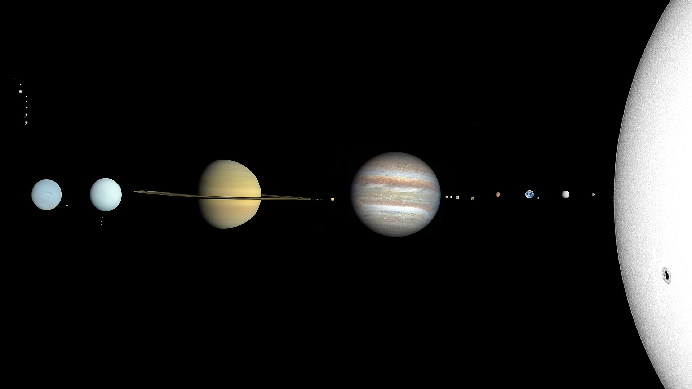

# 🌍☀️ Solar System Simulator 3D 🚀

[](https://jmonkeyengine.org/)
[](https://www.oracle.com/java/)
[](https://maven.apache.org/)

> **Simulation interactive du Système Solaire en 3D** 🌌 avec gestion des rotations, révolutions, HUD interactif, et affichage des informations des planètes en temps réel.



---

## 🎯 **Caractéristiques**
✔️ **Modélisation réaliste** du Soleil, des planètes et de leurs lunes  
✔️ **Simulation des orbites et rotations** en fonction des lois de Kepler  
✔️ **Système de gestion du temps**, avec évolution des années, mois et jours  
✔️ **Mode caméra dynamique** : FlyCam & ChaseCam 🚀  
✔️ **Affichage des informations des planètes** via API ou JSON local  
✔️ **Effets visuels avancés** : éclairage dynamique, textures haute résolution  

---

## 📦 **Prérequis**
- **Java 11+**  
- **Maven** installé  
- **jMonkeyEngine**  
- **OpenGL 3.0+**  

> ⚠️ **Assurez-vous d’avoir un GPU compatible avec OpenGL et les shaders avancés.**

---

## 🚀 **Installation et Exécution**
### 🔹 **1. Cloner le projet**
```bash
git clone https://github.com/LeZozzz/Solar-System-Project
cd Solar-System-Project
```

### 🔹 **2. Compiler le projet**
```bash
mvn clean install
```

### 🔹 **3. Lancer la simulation**
```bash
mvn exec:java -Dexec.mainClass="fr.univtln.eberge.solarsystem.App"
```

---

## 🎮 **Commandes du Jeu**
| Touche | Action |
|--------|--------|
| `ZQSD` | Deplacement (mode FlyCam) |
| `P` | Augmenter la vitesse du temps |
| `I` | Réduire la vitesse du temps |
| `O` | Inverser la direction des révolutions |
| `Espace` | Pause / Reprendre la simulation |
| `Flèche droite/gauche` | Changer de planète (mode ChaseCam) |
| `Flèche haut/bas` | Zoom avant/arrière (mode ChaseCam) |
| `C` | Basculer entre **FlyCam** et **ChaseCam** |
| `Échap` | Quitter l’application |

---

## 🌌 **Détails Techniques**
### 📺 **Structure du Projet**
```
solar-system/
│── src/main/java/fr/univtln/eberge/solarsystem/
│   ├── App.java               # Point d'entrée de l'application
│   ├── controls/              # Gestion des caméras & contrôles
│   ├── visuals/               # HUD, Skybox, Lumières, Effets
│   ├── body/                  # Modélisation des corps célestes
│   ├── utils/                 # Gestion du temps, fichiers JSON
│   └── api/                   # Récupération des données API
│
│── src/main/resources/Textures/
│   ├── Planets/               # Textures des planètes
│   ├── Moon/                  # Textures des lunes
│   └── Asteroids/             # Textures des astéroïdes
│
│── pom.xml                    # Configuration Maven
│── README.md                  # Ce fichier
```

---

## 🌟 **Améliorations Futures**
🔹 Réorganisation entière du **GUI**
🔹 **Affichage des constellations** et autres étoiles du ciel
🔹 Intégration de **données en temps réel** via API de la NASA

---

## 📝 **Licence**
📝 Ce projet est sous licence **MIT** - Tu peux l'utiliser librement et le modifier.
🌟 N'hésite pas à laisser une étoile 🌟 sur le repo si ce projet t'a aidé !

---

**🚀 Bon voyage dans l’espace ! 🚀**


